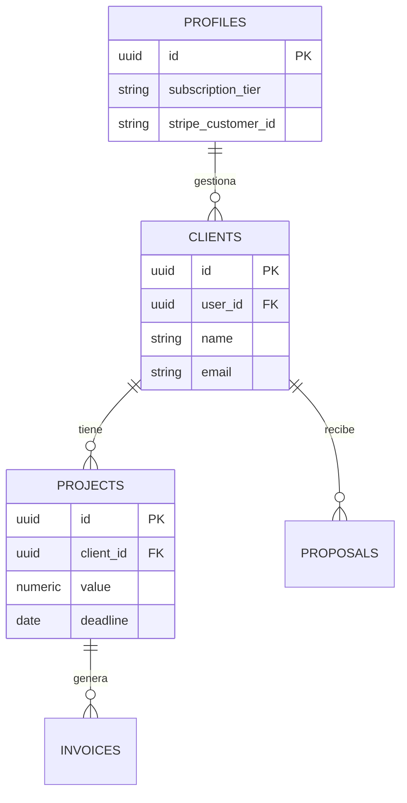

# Technical Architecture: FreeFlow CRM

> Documentación de ingeniería que detalla los patrones de diseño, seguridad y flujos de datos implementados en el núcleo de FreeFlow CRM.

---

## 1. Paradigma de Desarrollo

FreeFlow CRM utiliza una arquitectura **Full-Stack Monolítica Moderna** sobre **Next.js 15+**, optimizando la latencia y la seguridad mediante el uso intensivo del servidor.

### Estrategia de Renderizado
- **Server Components (RSC)**: Utilizados de forma predeterminada para el fetching de datos (Dashboard, Listas de clientes, Proyectos). Esto reduce drásticamente el bundle size en el cliente y mejora el SEO.
- **Client Components**: Restringidos exclusivamente a nodos de interactividad (Modales de formulario, botones de acción, Toasts).
- **Mutaciones (Server Actions)**: Toda la lógica de escritura (CRUD) se maneja mediante funciones asíncronas en el servidor con visibilidad restringida, eliminando la necesidad de exponer endpoints de API REST tradicionales.

---

## 2. Capas de Seguridad

La seguridad se aplica de forma redundante en múltiples niveles del stack:

### 2.1 Middleware (Edge Layer)
Ubicado en `src/middleware.ts`, actúa como guardián de sesión a nivel de red.
- **Validación de Sesión**: Utiliza `@supabase/ssr` para verificar la existencia de un JWT válido antes de permitir el acceso a la ruta `/dashboard`.
- **Redirección Proactiva**: Los usuarios no autenticados son forzados a `/login`, mientras que usuarios con sesión activa son redirigidos de `/login` al dashboard para optimizar el flujo de navegación.

### 2.2 Row Level Security (Postgres RLS)
Implementado directamente en la base de datos para garantizar el aislamiento de datos (Multi-tenancy).
- **Aislamiento**: Cada tabla (`clients`, `projects`, `invoices`, etc.) tiene habilitado RLS con la política `auth.uid() = user_id`.
- **Integridad**: Ningún usuario puede leer, editar o borrar datos que pertenezcan a otra identidad, incluso si logran bypassar la capa de aplicación.

### 2.3 Webhook Verification
El handler de Stripe (`src/app/api/webhooks/stripe/route.ts`) valida la firma criptográfica de cada evento entrante utilizando el `STRIPE_WEBHOOK_SECRET`, previniendo ataques de suplantación.

---

## 3. Flujos de Datos Críticos

### 3.1 Sincronización de Suscripciones
El ciclo de vida de la suscripción se orquesta de forma asíncrona pero consistente:

1. **Checkout**: El usuario es redirigido a Stripe Hosted Checkout.
2. **Webhook**: Stripe notifica el evento `checkout.session.completed` o `customer.subscription.deleted`.
3. **Admin Client**: Un cliente de Supabase con Service Role (bypass RLS) actualiza el `subscription_tier` en la tabla `profiles`.
4. **Enforcement**: Los Server Actions (como `addClient`) consultan el tier del perfil en tiempo real para aplicar límites (máx. 5 clientes en Free).

### 3.2 Agregación de KPIs
El Dashboard realiza agregaciones en el servidor antes del renderizado:
- **Revenue**: Suma de facturas con estado `paid`.
- **Pipeline**: Suma del valor de proyectos en estado `in-progress`.
- **Aislamiento de Lógica**: Los cálculos matemáticos se realizan en el servidor, entregando al cliente solo los valores finales formateados (`formatCurrency`).

---

## 4. Estructura de Datos (Esquema ER)

El sistema se basa en un esquema relacional optimizado para la trazabilidad operativa:

---

## 5. UX Especializada: Auto-Login

Para facilitar la auditoría de reclutadores, se implementó un flujo de **Autenticación Asíncrona vía Query Params**:
- **Detector**: El componente `LoginPage` escucha el parámetro `?demo=true`.
- **Ejecución**: Dispara `signInWithPassword` utilizando credenciales de entorno seguras.
- **Feedback**: Muestra una UI de carga dedicada con un spinner de Lucide para comunicar el proceso sistémico.
