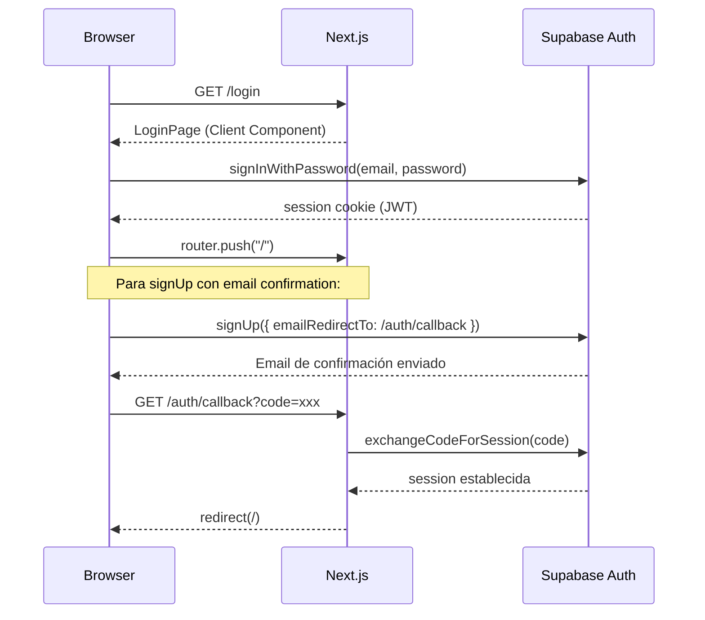
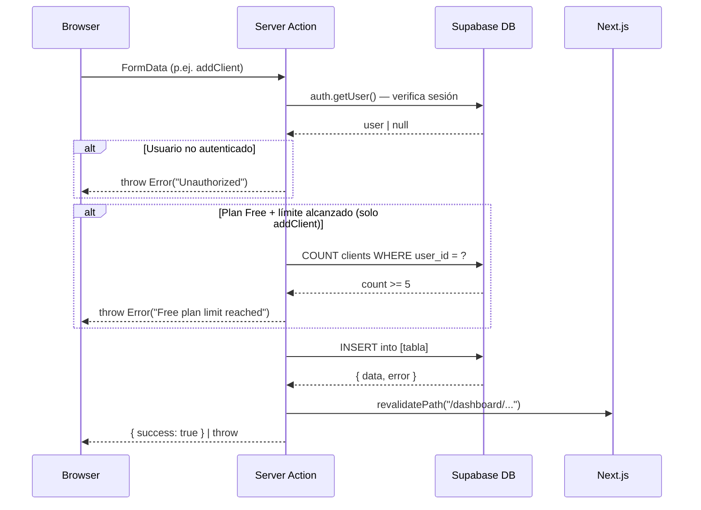
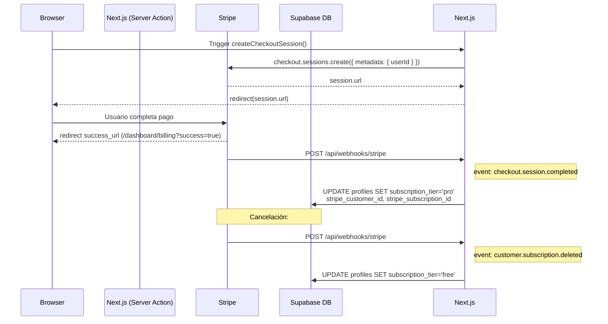

# ARCHITECTURE.md — FreeFlow CRM

> Documento técnico de arquitectura. 
---

## 1. Patrón Arquitectónico

FreeFlow CRM implementa una arquitectura **Full-Stack Monolítica Modular** utilizando el **Next.js App Router** como capa unificadora. El patrón se puede clasificar como:

- **Rendering**: Server Components por defecto, con Client Components (`'use client'`) estrictamente limitados a elementos interactivos (formularios, toggles, sidebar con estado).
- **Mutaciones**: **Server Actions** (`'use server'`) — se eliminó completamente la capa de API REST para operaciones CRUD internas. Las acciones se co-localizan con sus rutas en archivos `actions.ts`.
- **BaaS**: Supabase como capa completa de base de datos, autenticación y almacenamiento de sesión.
- **Pagos**: Stripe Checkout (hosted) + Billing Portal para gestión de suscripciones, con webhook para sincronización de estado.

---

## 2. Estructura de Directorios

```
freeflow-crm/
└── src/
    ├── app/                        # Next.js App Router (File-based routing)
    │   ├── layout.tsx              # Root layout: ThemeProvider + Toaster
    │   ├── page.tsx                # Entry point → redirect implícito a /login
    │   ├── login/
    │   │   └── page.tsx            # [Client] Auth form (signIn + signUp)
    │   ├── auth/
    │   │   └── callback/
    │   │       └── route.ts        # PKCE callback: intercambia code → session
    │   ├── api/
    │   │   └── webhooks/
    │   │       └── stripe/
    │   │           └── route.ts    # POST: Stripe webhook handler
    │   └── dashboard/
    │       ├── page.tsx            # [Server] KPI aggregation + recent projects
    │       ├── clients/
    │       │   ├── actions.ts      # addClient (con límite freemium)
    │       │   └── page.tsx        # [Server] Client list + dialog trigger
    │       ├── projects/
    │       │   ├── actions.ts      # addProject, createInvoiceFromProject
    │       │   └── page.tsx
    │       ├── invoices/
    │       │   ├── actions.ts      # addInvoice, updateInvoiceStatus, deleteInvoice
    │       │   └── page.tsx
    │       ├── proposals/
    │       │   ├── actions.ts      # addProposal, updateProposalStatus, deleteProposal
    │       │   └── page.tsx
    │       ├── billing/
    │       │   ├── actions.ts      # createCheckoutSession → Stripe redirect
    │       │   └── page.tsx        # [Server] Plan comparison + UpgradeButton
    │       └── settings/
    │           ├── actions.ts      # updateProfile, createPortalSession
    │           └── page.tsx        # [Server] Tabs: Profile / Subscription / Appearance
    │
    ├── components/
    │   ├── layout/
    │   │   ├── Sidebar.tsx         # [Client] Nav + PRO badge + logout
    │   │   ├── Header.tsx          # Header shell
    │   │   └── SafeDashboardLayout.tsx  # Layout wrapper para Server Components
    │   ├── dashboard/
    │   │   └── SafeDashboard.tsx   # [Client] KPI cards + recent projects table
    │   ├── clients/
    │   │   └── ClientFormDialog.tsx # [Client] Modal form → addClient action
    │   ├── billing/
    │   │   └── UpgradeButton.tsx   # [Client] Button → createCheckoutSession action
    │   ├── auth/
    │   │   └── LogoutButton.tsx    # [Client] Button → supabase.auth.signOut()
    │   ├── settings/
    │   │   └── ThemeToggle.tsx     # [Client] Switch → next-themes
    │   ├── ui/                     # Shadcn/UI primitives (Radix UI wrapped)
    │   │   └── [avatar, badge, button, card, dialog, dropdown-menu,
    │   │       input, label, select, sheet, skeleton, sonner,
    │   │       switch, table, tabs, textarea]
    │   └── theme-provider.tsx      # next-themes ThemeProvider wrapper
    │
    └── lib/
        ├── server-supabase.ts      # createClient() — SSR cookie-aware (para Server Components & Actions)
        ├── supabase.ts             # createClient() — browser client (para Client Components)
        ├── supabase-admin.ts       # createAdminClient() — Service Role (solo webhooks)
        ├── stripe.ts               # Singleton Stripe instance
        ├── format.ts               # formatCurrency() — Intl.NumberFormat USD
        └── utils.ts                # cn() — tailwind-merge + clsx helper
```

---

## 3. Flujo de Datos

### 3.1 Autenticación



### 3.2 Mutación CRUD (patrón Server Action)



### 3.3 Flujo de Pago (Stripe Checkout)



---

## 4. Módulos Core

### 4.1 Supabase Client Factory (Tres variantes)

| Archivo | Uso | Credenciales | Contexto |
|---|---|---|---|
| `lib/server-supabase.ts` | Server Components, Server Actions | `ANON_KEY` + cookies | Servidor SSR |
| `lib/supabase.ts` | Client Components | `ANON_KEY` | Browser |
| `lib/supabase-admin.ts` | Webhook handler | `SERVICE_ROLE_KEY` | Servidor sin sesión |

> La separación de clientes es crítica: el `adminClient` bypasea Row Level Security (RLS) y solo debe usarse en contextos serverless de confianza (webhooks firmados por Stripe).

### 4.2 Modelo de Datos (Tablas Supabase)

```
profiles ──────────────────────────────────────────────────
│  id (UUID, FK → auth.users)                              │
│  full_name, subscription_tier (free|pro)                 │
│  stripe_customer_id, stripe_subscription_id              │
└──────────────────────────────────────────────────────────

clients ──────────────────────────── invoices
│  id, user_id (FK)                │  id, user_id (FK)
│  name, email, phone, company     │  client_id (FK → clients)
│  status                          │  project_id (FK → projects)
│                                  │  amount, due_date, status
│                                  │  notes
└──────────────────── projects ─────┘
                    │  id, user_id (FK)
                    │  client_id (FK → clients)
                    │  name, status, value, deadline
                    └────────────────────────────

proposals ──────────────────────────────────────
│  id, user_id (FK)
│  client_id (FK → clients)
│  title, description, value, status
└───────────────────────────────────────────────
```

### 4.3 Lógica de Suscripción (Freemium Gate)

La restricción de plan se aplica **en el servidor**, dentro del Server Action `addClient`:

```typescript
// dashboard/clients/actions.ts
if (profile?.subscription_tier !== "pro") {
    const { count } = await supabase
        .from("clients")
        .select("*", { count: "exact", head: true })
        .eq("user_id", user.id);

    if (count !== null && count >= 5) {
        throw new Error("Free plan limit reached (5 clients). Please upgrade to Pro.");
    }
}
```

**Límites por plan:**

| Feature | Free | Pro |
|---|---|---|
| Clientes | Máx. 5 | Ilimitados |
| Proyectos | Sin restricción de código | Sin restricción |
| Facturas | Sin restricción de código | Sin restricción |
| Propuestas | Sin restricción de código | Sin restricción |
| Portal de Billing | ✗ | ✓ (Stripe Portal) |
| Precio | $0/mes | $19/mes |

### 4.4 Dashboard KPI Aggregation

El `dashboard/page.tsx` ejecuta **3 queries paralelas en el servidor** y pasa los resultados como props al Client Component `SafeDashboard`:

```
Supabase Query 1: COUNT clients WHERE status='active'     → activeClientsCount
Supabase Query 2: SELECT value, status FROM projects      → pipelineValue (suma non-cancelled)
Supabase Query 3: SELECT amount FROM invoices             → totalRevenue (paid) + outstandingRevenue (pending)
```

El componente `SafeDashboard` usa un `isMounted` guard para evitar hydration mismatches en los formateos de moneda (`Intl.NumberFormat`).

### 4.5 Generación de Factura desde Proyecto

El Server Action `createInvoiceFromProject` implementa una conversión directa:

```
Project (value, client_id) → Invoice (amount=project.value, due_date=now+7d, status='pending')
```

Esto conecta el módulo de **Proyectos** con el de **Facturación** sin UI adicional.

---

## 5. API & Integraciones

### 5.1 Stripe Webhook — `POST /api/webhooks/stripe`

| Evento | Acción en DB |
|---|---|
| `checkout.session.completed` | `profiles.subscription_tier = 'pro'`, guarda `stripe_customer_id` y `stripe_subscription_id` |
| `customer.subscription.updated` | **Parcialmente implementado** — solo estructura, sin lógica de degradación (ver Roadmap) |
| `customer.subscription.deleted` | `profiles.subscription_tier = 'free'` por `stripe_subscription_id` |

**Seguridad:** El webhook valida la firma de Stripe con `stripe.webhooks.constructEvent(body, signature, STRIPE_WEBHOOK_SECRET)` antes de procesar cualquier evento. Usa `createAdminClient()` (Service Role) para poder escribir en `profiles` sin restricciones RLS.

### 5.2 Stripe Billing Portal — Server Action

```
createPortalSession() → stripe.billingPortal.sessions.create() → redirect(session.url)
```

Solo disponible para usuarios con `stripe_customer_id` en su perfil (usuarios Pro activos). Permite cancelar, actualizar tarjeta y ver historial de pagos directamente en la interfaz de Stripe.

### 5.3 Supabase Auth — Email + Password

- **Login:** `signInWithPassword` → session JWT en cookies HttpOnly
- **Registro:** `signUp` con `emailRedirectTo: /auth/callback` → flujo PKCE
- **Callback:** `GET /auth/callback` — intercambia `code` por session y redirige al usuario

---

## 6. Problemas Técnicos Detectados (Deuda Técnica)

| Severidad | Hallazgo | Archivo |
|---|---|---|
| 🔴 **CRÍTICO** | El middleware NO protege ninguna ruta — cualquier URL del dashboard es accesible sin autenticación | `src/middleware.ts` |
| 🟠 **ALTO** | `customer.subscription.updated` tiene handler vacío — cambios de estado `past_due` no se procesan | `src/app/api/webhooks/stripe/route.ts:43-53` |
| 🟡 **MEDIO** | Ausencia de RLS (Row Level Security) documentada — si no está habilitada en Supabase, usuarios pueden acceder a datos de otros | Supabase config |
| 🟡 **MEDIO** | `recentProjects` usa `any[]` sin tipado — pérdida de seguridad de tipos en el componente dashboard | `src/components/dashboard/SafeDashboard.tsx:19` |
| 🟢 **BAJO** | No existe página `/auth/auth-code-error` referenciada en el callback | `src/app/auth/callback/route.ts:37` |
| 🟢 **BAJO** | No hay funcionalidad de editar/eliminar clientes — solo inserción | `src/app/dashboard/clients/` |

---

## 7. Roadmap Actual

Basado en comentarios `// [PHASE 3]` y TODOs detectados en el código:

- **[ ] Habilitar protección de rutas en middleware** — verificar sesión Supabase antes de permitir acceso al dashboard.
- **[ ] Implementar lógica `subscription.updated`** — degradar a `free` si status es `past_due` o `canceled`.
- **[ ] Configurar RLS en Supabase** — políticas por `user_id` en todas las tablas.
- **[ ] Tipado estricto** — reemplazar `any[]` en props del dashboard con tipos derivados de Supabase.
- **[ ] CRUD completo en clientes** — edición inline y eliminación con confirmación.
- **[ ] Página de error auth** — crear `/auth/auth-code-error`.
